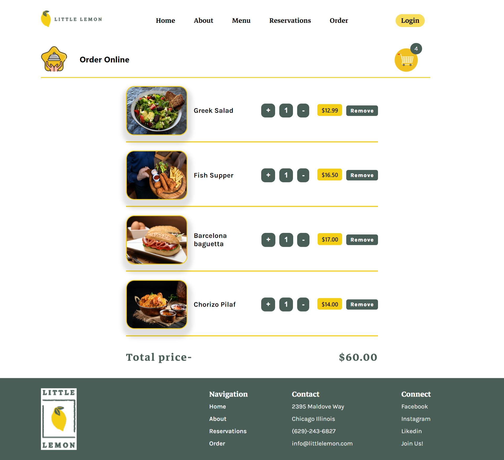

# ✨Little Lemon Restaurant Website

### This is a React-based website for a restaurant where customers can order food online and book a table for dining in. This project is from Frontend Capstone from coursera
 

# ✨Features
1. A menu section where customers can browse through the dishes and add them to their cart.
 

2. An online ordering system where customers can place their orders
 

3. A reservation system where customers can book a table for dining in at the restaurant.

 

# ✨Technologies & Packages  Used
1. React: A JavaScript library for building user interfaces.
2. React Router: A routing library for React applications.
3. react-slick: A react package for responsive and smooth carausels
4. react-hook-form: A react package for form validation
5. CSS: The website is totally built on pure css

 

## Home page of restaurant website ⬇️

 

## Reserve table page ⬇️

 

## Order Online page ⬇️

 

## Cart page ⬇️

 

# ✨Getting Started
To run this application on your local machine, you need to follow these steps:

1. Clone the repository: `git clone` https://github.com/Pritika17/Little_Lemon_Table_Booking_ReactApp.git
2. Navigate to the project directory: `cd restaurant-website`
3. Install the dependencies: `npm install`
4. Start the development server: `npm start`
5. Open your web browser and go to http://localhost:3000